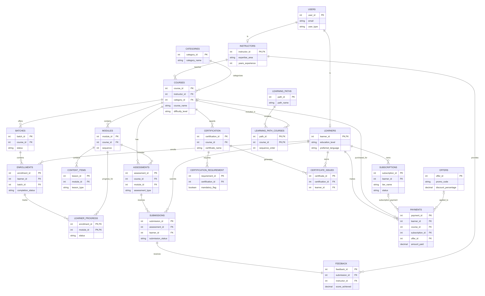

# Online Learning Platform Database Design

---

# Cover Page

**Case Study Title:** Online Learning Platform

**Group Number:** B4

## Team Members

| Student Name | Roll Number |
|-------------|------------|
| Abhishek Chauhan | 10165 |
| Mahak Agarwal | 10489 |
| Shivam Kumar | 10149 |
| Shriniwas Vanjare | 10240 |
| Angel Singh Angel | 10712 |
| Daksh Kothari | 10424 |
| Arkajyoti Mondal | 10160 |
| Sai Venkat Gautam Jampala | 10307 |
| Harsh Srivastava | 10182 |
| Arsalan Rashid | 10385 |

# 1. Assumptions

The following assumptions and business rules were considered while designing the database:

1. A user can have one role at a time: Learner, Instructor, or Admin.

2. Every learner and instructor must have a corresponding record in the Users table.

3. Each course belongs to exactly one category, while a category can contain multiple courses.

4. Each course is managed by one instructor, while an instructor can teach multiple courses.

5. A course consists of one or more modules arranged in a predefined sequence.

6. Each module may contain multiple content items such as videos, documents, audio files, or learning resources.

7. A course may be offered in multiple batches.

8. Learners enroll in batches rather than directly in courses.

9. Learner progress is tracked at the module level.

10. Assessments can be associated with a course or a specific module.

11. Feedback and scores are provided by instructors after evaluating submissions.

12. Certifications are awarded only after all mandatory certification requirements are fulfilled.

13. A learner can receive a particular certification only once.

14. A learning path contains multiple courses arranged in a predefined order.

15. Promotional offers can be applied during payments, subject to validity constraints.

16. Payments may be made for course purchases or subscription plans.

17. The database is designed to support future scalability and additional features.

18. A learner cannot enroll in the same batch more than once.

19. Assessment passing marks must not exceed total marks.

20. A course must contain at least one module.

21. Every feedback record must be provided by a valid instructor.

22. Every submission must belong to a valid learner.

---

# 2. ER Diagram

The following ER Diagram represents the conceptual and logical structure of the Online Learning Platform database.

# Complete ER Diagram

The ER Diagram includes:

- Entities
- Attributes
- Primary Keys
- Foreign Keys
- Relationships
- Cardinalities

---

# 3. Relational Schema

## Users

| Column Name | Data Type | Constraints/Description |
|------------|-----------|------------------------|
| user_id | SERIAL | PK |
| first_name | VARCHAR(100) | NOT NULL |
| last_name | VARCHAR(100) | NOT NULL |
| email | VARCHAR(255) | UNIQUE, NOT NULL |
| password_hash | VARCHAR(255) | NOT NULL |
| phone_number | VARCHAR(15) | NULL |
| date_of_birth | DATE | NULL |
| country_code | CHAR(2) | NULL |
| user_type | ENUM('learner','instructor','admin') | NOT NULL |
| is_active | BOOLEAN | DEFAULT TRUE |
| created_at | TIMESTAMP | DEFAULT CURRENT_TIMESTAMP |
| updated_at | TIMESTAMP | DEFAULT CURRENT_TIMESTAMP ON UPDATE CURRENT_TIMESTAMP |

**Primary Key:** user_id

---

## Learners

| Column Name | Data Type | Constraints/Description |
|------------|-----------|------------------------|
| learner_id | INT | PK, FK -> Users(user_id) |
| learning_goals | TEXT | |
| education_level | VARCHAR(50) | NULL |
| industry_experience | INT | NULL, CHECK(industry_experience >= 0) |
| preferred_language | VARCHAR(50) | DEFAULT 'English' |

**Primary Key:** learner_id

**Foreign Key:** learner_id → Users(user_id)

---

## Instructors

| Column Name | Data Type | Constraints/Description |
|------------|-----------|------------------------|
| instructor_id | INT | PK, FK(Users) |
| qualification | VARCHAR(255) | NOT NULL |
| expertise_area | VARCHAR(100) | NOT NULL |
| years_experience | INT | NOT NULL, CHECK >= 0 |
| bio | TEXT | NULL |
| resume_url | VARCHAR(512) | NULL |
| verification_status | ENUM | DEFAULT 'Pending' |

**Primary Key:** instructor_id

**Foreign Key:** instructor_id → Users(user_id)

---

## Categories

| Column Name | Data Type | Constraints/Description |
|------------|-----------|------------------------|
| category_id | SERIAL | PK, NOT NULL |
| category_name | VARCHAR(100) | UNIQUE, NOT NULL |

**Primary Key:** category_id

---

## Courses

| Column Name | Data Type | Constraints/Description |
|------------|-----------|------------------------|
| course_id | SERIAL | PK, NOT NULL |
| instructor_id | INT | FK -> Instructors(instructor_id), NOT NULL |
| category_id | INT | FK -> Categories(category_id), NOT NULL |
| course_name | VARCHAR(255) | NOT NULL |
| description | TEXT | NOT NULL |
| difficulty_level | VARCHAR(20) | CHECK(difficulty_level IN ('Beginner','Intermediate','Advanced')) |
| duration_hours | INT | CHECK(duration_hours > 0) |
| price | DECIMAL(10,2) | CHECK(price >= 0.00) |
| is_published | BOOLEAN | DEFAULT FALSE |
| created_at | TIMESTAMP | DEFAULT CURRENT_TIMESTAMP |

**Primary Key:** course_id

**Foreign Keys:**
- instructor_id → Instructors(instructor_id)
- category_id → Categories(category_id)

---

## Batches

| Column Name | Data Type | Constraints/Description |
|------------|-----------|------------------------|
| batch_id | SERIAL | PK |
| course_id | INT | FK -> Courses(course_id), ON DELETE CASCADE |
| batch_name | VARCHAR(100) | NOT NULL |
| start_date | DATE | NOT NULL |
| end_date | DATE | NOT NULL |
| max_enrollments | INT | CHECK(max_enrollments > 0) |
| status | VARCHAR(20) | CHECK(status IN ('Upcoming','Ongoing','Completed')) |
| created_at | TIMESTAMP | DEFAULT CURRENT_TIMESTAMP |

**Primary Key:** batch_id

**Foreign Key:** course_id → Courses(course_id)

---

## Modules

| Column Name | Data Type | Constraints/Description |
|------------|-----------|------------------------|
| module_id | SERIAL | PK |
| course_id | INT | FK -> Courses(course_id), ON DELETE CASCADE |
| module_title | VARCHAR(255) | NOT NULL |
| sequence | INT | CHECK(sequence > 0) |
| duration_hours | INT | CHECK(duration_hours > 0) |
| is_required | BOOLEAN | DEFAULT TRUE |
| created_at | TIMESTAMP | DEFAULT CURRENT_TIMESTAMP |
| uq_course_sequence | CONSTRAINT | UNIQUE(course_id, sequence) |

**Primary Key:** module_id

**Foreign Key:** course_id → Courses(course_id)

---

## Enrollments

| Column Name | Data Type | Constraints/Description |
|------------|-----------|------------------------|
| enrollment_id | SERIAL | PRIMARY KEY |
| learner_id | INT | NOT NULL REFERENCES Learners(learner_id) |
| batch_id | INT | NOT NULL REFERENCES Batches(batch_id) |
| enrollment_date | TIMESTAMP | DEFAULT CURRENT_TIMESTAMP |
| completion_status | VARCHAR(20) | CHECK(completion_status IN ('In Progress','Completed','Dropped')) |
| completion_date | TIMESTAMP | NULL |

**Primary Key:** enrollment_id

**Foreign Keys:**
- learner_id → Learners(learner_id)
- batch_id → Batches(batch_id)

**Unique Constraint:** (learner_id, batch_id)

---

## LearnerProgress

| Column Name | Data Type | Constraints/Description |
|------------|-----------|------------------------|
| enrollment_id | INT | FK -> Enrollments(enrollment_id) |
| module_id | INT | FK -> Modules(module_id) |
| status | VARCHAR(20) | CHECK(status IN ('Not Started','In Progress','Completed')) |
| completion_date | TIMESTAMP | NULL |
| pk_learner_progress | CONSTRAINT | PRIMARY KEY(enrollment_id, module_id) |

**Composite Primary Key:** (enrollment_id, module_id)

**Foreign Keys:**
- enrollment_id → Enrollments(enrollment_id)
- module_id → Modules(module_id)

---

## ContentItems

| Column Name | Data Type | Constraints/Description |
|------------|-----------|------------------------|
| lesson_id | SERIAL | PK |
| module_id | INT | FK -> Modules(module_id), ON DELETE CASCADE |
| lesson_title | VARCHAR(255) | NOT NULL |
| lesson_type | VARCHAR(20) | CHECK(lesson_type IN ('Video','Audio','Document')) |
| content | TEXT | NOT NULL |
| sequence | INT | CHECK(sequence > 0) |
| resource_url | VARCHAR(500) | NULL |

**Primary Key:** lesson_id

**Foreign Key:** module_id → Modules(module_id)

---

## Assessments

| Column Name | Data Type | Constraints/Description |
|------------|-----------|------------------------|
| assessment_id | SERIAL | PRIMARY KEY |
| course_id | INT | NOT NULL REFERENCES Courses(course_id) ON DELETE CASCADE |
| module_id | INT | REFERENCES Modules(module_id) ON DELETE SET NULL |
| assessment_title | VARCHAR(255) | NOT NULL |
| description | TEXT | |
| assessment_type | VARCHAR(50) | NOT NULL |
| total_marks | DECIMAL(5, 2) | NOT NULL CHECK(total_marks > 0) |
| passing_marks | DECIMAL(5, 2) | NOT NULL CHECK(passing_marks >= 0) |
| due_date | TIMESTAMP | NOT NULL |
| is_required | BOOLEAN | DEFAULT TRUE |
| chk_assessment_marks | CONSTRAINT | CHECK(passing_marks <= total_marks) |

**Primary Key:** assessment_id

---

## Submissions

| Column Name | Data Type | Constraints/Description |
|------------|-----------|------------------------|
| submission_id | SERIAL | PRIMARY KEY |
| assessment_id | INT | NOT NULL REFERENCES Assessments(assessment_id) ON DELETE CASCADE |
| learner_id | INT | NOT NULL REFERENCES Learners(learner_id) ON DELETE RESTRICT |
| submission_file_url | VARCHAR(500) | NOT NULL |
| submission_date | TIMESTAMP | NOT NULL DEFAULT CURRENT_TIMESTAMP |
| submission_status | VARCHAR(20) | NOT NULL CHECK(submission_status IN ('Submitted','Late','Resubmitted')) |

**Primary Key:** submission_id

---

## Feedback

| Column Name | Data Type | Constraints/Description |
|------------|-----------|------------------------|
| feedback_id | SERIAL | PRIMARY KEY |
| submission_id | INT | UNIQUE NOT NULL REFERENCES submissions(submission_id) ON DELETE CASCADE |
| instructor_id | INT | NOT NULL REFERENCES Instructors(instructor_id)|
| feedback_text | TEXT | NOT NULL |
| score_achieved | DECIMAL(5, 2) | NOT NULL CHECK(score_achieved >= 0.00) |
| provided_date | TIMESTAMP | NOT NULL DEFAULT CURRENT_TIMESTAMP |

**Primary Key:** feedback_id

---

## Subscriptions

| Column Name | Data Type | Constraints/Description |
|------------|-----------|------------------------|
| subscription_id | SERIAL | PRIMARY KEY |
| learner_id | INT | NOT NULL REFERENCES Learners(learner_id) ON DELETE RESTRICT |
| tier_name | VARCHAR(50) | NOT NULL |
| start_date | TIMESTAMP | NOT NULL |
| end_date | TIMESTAMP | NOT NULL |
| status | VARCHAR(20) | NOT NULL DEFAULT 'active' |
| created_at | TIMESTAMP | DEFAULT CURRENT_TIMESTAMP |
| chk_subscription_timeline | CONSTRAINT | CHECK(end_date > start_date) |
| chk_subscription_status | CONSTRAINT | CHECK(status IN ('active', 'cancelled', 'past_due', 'expired')) |

**Primary Key:** subscription_id

---

## Offers

| Column Name | Data Type | Constraints/Description |
|------------|-----------|------------------------|
| offer_id | SERIAL | PRIMARY KEY |
| promo_code | VARCHAR(50) | UNIQUE NOT NULL |
| discount_percentage | DECIMAL(5, 2) | NOT NULL |
| max_uses | INT | NOT NULL CHECK(max_uses > 0) |
| current_uses | INT | DEFAULT 0 CHECK(current_uses >= 0) |
| valid_from | TIMESTAMP | NOT NULL |
| valid_until | TIMESTAMP | NOT NULL |
| created_at | TIMESTAMP | DEFAULT CURRENT_TIMESTAMP |
| chk_offer_timeline | CONSTRAINT | CHECK(valid_until > valid_from) |
| chk_discount_bounds | CONSTRAINT | CHECK(discount_percentage > 0.00 AND discount_percentage <= 100.00) |
| chk_uses_limit | CONSTRAINT | CHECK(current_uses <= max_uses) |

**Primary Key:** offer_id

---

## Payments

| Column Name | Data Type | Constraints/Description |
|------------|-----------|------------------------|
| payment_id | SERIAL | PRIMARY KEY |
| learner_id | INT | NOT NULL REFERENCES Learners(learner_id) ON DELETE RESTRICT |
| course_id | INT | REFERENCES Courses(course_id) ON DELETE SET NULL |
| subscription_id | INT | REFERENCES Subscriptions(subscription_id) ON DELETE SET NULL |
| offer_id | INT | REFERENCES Offers(offer_id) ON DELETE SET NULL |
| amount_paid | DECIMAL(10, 2) | NOT NULL |
| transaction_status | VARCHAR(30) | NOT NULL DEFAULT 'completed' |
| payment_gateway_ref | VARCHAR(255) | UNIQUE NOT NULL |
| paid_at | TIMESTAMP | DEFAULT CURRENT_TIMESTAMP |
| chk_payment_bounds | CONSTRAINT | CHECK(amount_paid >= 0.00) |
| chk_payment_status | CONSTRAINT | CHECK(transaction_status IN ('completed', 'failed', 'refunded', 'processing')) |
| chk_payment_target | CONSTRAINT | CHECK(course_id IS NOT NULL OR subscription_id IS NOT NULL) |

**Primary Key:** payment_id

---

## Certification

| Column Name | Data Type | Constraints/Description |
|------------|-----------|------------------------|
| certification_id | SERIAL | PK |
| course_id | INT | FK -> Courses(course_id), NOT NULL |
| certificate_name | VARCHAR(255) | NOT NULL |
| description | TEXT | NULL |
| created_at | TIMESTAMP | DEFAULT CURRENT_TIMESTAMP |

**Primary Key:** certification_id

---

## CertificationRequirement

| Column Name | Data Type | Constraints/Description |
|------------|-----------|------------------------|
| requirement_id | SERIAL | PK |
| certification_id | INT | FK -> Certification(certification_id), NOT NULL |
| requirement_description | TEXT | NOT NULL |
| mandatory_flag | BOOLEAN | DEFAULT TRUE |

**Primary Key:** requirement_id

---

## CertificateIssued

| Column Name | Data Type | Constraints/Description |
|------------|-----------|------------------------|
| certificate_id | SERIAL | PK |
| certification_id | INT | FK -> Certification(certification_id), NOT NULL |
| learner_id | INT | FK -> Learners(learner_id), NOT NULL |
| issue_date | TIMESTAMP | DEFAULT CURRENT_TIMESTAMP |
| certificate_number | VARCHAR(100) | UNIQUE, NOT NULL |

**Primary Key:** certificate_id

---

## LearningPaths

| Column Name | Data Type | Constraints/Description |
|------------|-----------|------------------------|
| path_id | SERIAL | PRIMARY KEY |
| path_name | VARCHAR(255) | UNIQUE NOT NULL |
| description | TEXT | |
| created_at | TIMESTAMP | DEFAULT CURRENT_TIMESTAMP |

**Primary Key:** path_id

---

## LearningPathCourses

| Column Name | Data Type | Constraints/Description |
|------------|-----------|------------------------|
| path_id | INT | NOT NULL REFERENCES LearningPaths(path_id) ON DELETE CASCADE |
| course_id | INT | NOT NULL REFERENCES Courses(course_id) ON DELETE RESTRICT |
| sequence_order | INT | NOT NULL CHECK(sequence_order > 0) |
| pk_learning_path_courses | CONSTRAINT | PRIMARY KEY(path_id, course_id) |
| uq_path_sequence | CONSTRAINT | UNIQUE(path_id, sequence_order) |

**Composite Primary Key:** (path_id, course_id)

**Foreign Keys:**
- path_id → LearningPaths(path_id)
- course_id → Courses(course_id)

**Unique Constraint:** (path_id, sequence_order)

# 4. Constraints

## NOT NULL Constraints

Examples:

- Users.first_name
- Users.last_name
- Users.email
- Courses.course_name
- Assessments.assessment_title
- Certification.certificate_name

## UNIQUE Constraints

Examples:

- Users.email
- Categories.category_name
- CertificateIssued.certificate_number
- Offers.promo_code
- Enrollments(learner_id, batch_id)

## CHECK Constraints

Examples:

- industry_experience >= 0
- years_experience >= 0
- duration_hours > 0
- price >= 0
- max_enrollments > 0
- discount_percentage <= 100
- passing_marks <= total_marks

## Referential Integrity Constraints

All foreign keys maintain referential integrity between related tables.

Examples:

- Courses.category_id → Categories.category_id
- Modules.course_id → Courses.course_id
- Enrollments.learner_id → Learners.learner_id
- Payments.subscription_id → Subscriptions.subscription_id

---

# 5. Normalization

The database schema has been normalized up to Third Normal Form (3NF).

## First Normal Form (1NF)

- All attributes contain atomic values.
- No repeating groups exist.
- Every table has a primary key.

## Second Normal Form (2NF)

- The schema satisfies 1NF.
- All non-key attributes depend entirely on the primary key.
- No partial dependencies exist.

### Example

The table LearningPathCourses(path_id, course_id, sequence_order) uses a composite primary key. The attribute sequence_order depends on the complete key rather than only one part of it, satisfying Second Normal Form (2NF).

## Third Normal Form (3NF)

- The schema satisfies 2NF.
- No transitive dependencies exist.

### Example

Course information stores only foreign keys such as `category_id` and `instructor_id`.

Category details are maintained in the `Categories` table, while instructor details are maintained in the `Instructors` table.

This separation eliminates redundancy and prevents update anomalies.

### Example

The bridge table `LearningPathCourses(path_id, course_id)` resolves a many-to-many relationship without introducing duplicate course or learning path information.

### Conclusion

The schema satisfies Third Normal Form (3NF) by ensuring that every non-key attribute depends only on the key, the whole key, and nothing but the key.

---

# 6. Indexing Strategy

| Frequent Query | Suggested Index |
|---------------|----------------|
| Courses with highest enrollment counts | Enrollments(batch_id) |
| Average assessment scores by course | Assessments(course_id) |
| Learners completing certification requirements | CertificateIssued(learner_id) |
| Pending submissions | Submissions(submission_status) |
| Revenue by category | Courses(category_id), Payments(course_id) |
| Learning path completion rates | LearningPathCourses(path_id) |

### Justification

These indexes improve query performance by reducing lookup time and supporting efficient joins on frequently accessed attributes.

---

# 7. Design Justification

1. User information is centralized in the Users table to avoid redundancy.

2. Learning paths and courses are connected through a bridge table to resolve a many-to-many relationship.

3. Learner progress is tracked at the module level to provide detailed course completion analytics.

4. Certification requirements are stored separately to support flexible certification criteria.

5. The schema is normalized to 3NF, minimizing redundancy and maintaining consistency.

6. Appropriate constraints and indexes ensure data integrity and efficient query execution.

7. The Enrollments table acts as an associative entity between Learners and Batches, enabling enrollment history tracking, completion monitoring, and learner progress management.

---

# Appendix

## Additional Notes

- Schema designed for scalability.
- Supports future feature additions.
- Follows relational database design best practices.